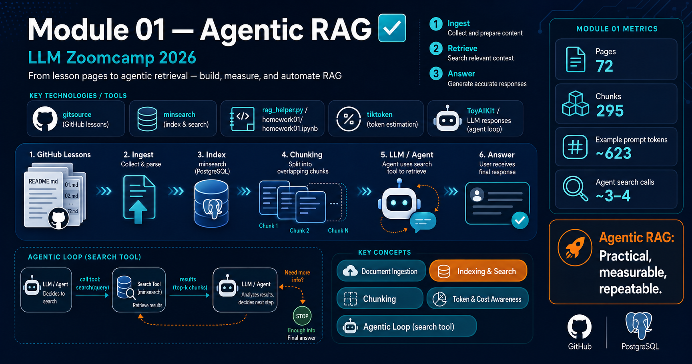
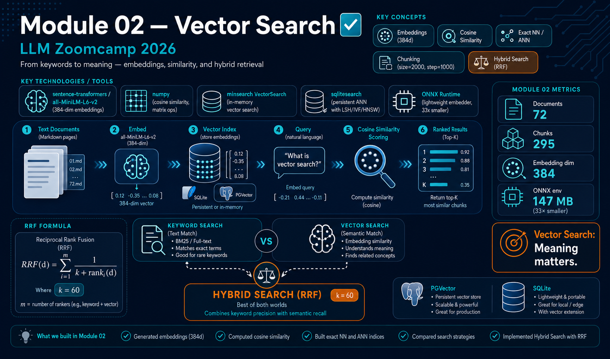
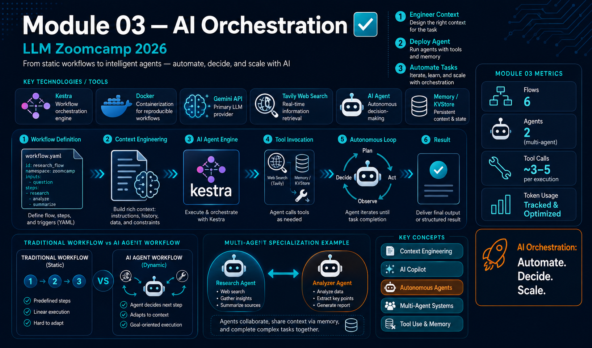

# llm-zoomcamp-2026

This repository hosts materials and homeworks for the [LLM Zoomcamp](https://llm-zoomcamp.datatalks.club/) maintained by RuiFSPinto.

## Overview

- **Purpose:** Central place for course modules, class materials, and homework assignments.
- **Structure:** Each module lives in a top-level folder named `NN-topic-name` with `class_materials/` and `homeworkNN/` subdirectories.
- **Reference:** Inspired by [DataTalksClub/llm-zoomcamp](https://github.com/DataTalksClub/llm-zoomcamp)

## Course Progress

| Module | Topic | Status | Links |
|--------|-------|--------|-------|
| 01 | Agentic RAG | ✅ Complete | [Materials](01-agentic-rag/class_materials) \| [Homework](01-agentic-rag/homework01) |
| 02 | Vector Search | ✅ Complete | [Materials](02-vector-search/class_materials) \| [Homework](02-vector-search/homework02) |
| 03 | AI Orchestration | ✅ Complete | [Materials](03-orchestration/class_materials) \| [Homework](03-orchestration/homework03) |
| 04 | Evaluation | 📋 Planned | — |
| 05 | Monitoring | 📋 Planned | — |
| 06 | Best Practices | 📋 Planned | — |
| 07 | Project Example | 📋 Planned | — |

## Module Details

### 01 — Agentic RAG

**Key Topics:**

- RAG fundamentals: combining a retriever (index/search) with an LLM to answer queries using retrieved context instead of relying only on the model's parametric knowledge.
- Document ingestion: fetching lesson markdown files from GitHub with `gitsource` and parsing into simple documents.
- Indexing and search: using `minsearch` to index content and keyword fields; validating retrieval quality.
- Chunking for better retrieval: splitting long pages into overlapping chunks for more precise matches.
- Token usage and cost awareness: estimating prompt tokens with `tiktoken`, reading provider-reported usage, and computing cost.
- Making RAG robust: adapting to different document structures and index APIs.
- Agentic loop: giving the model a `search` tool and running an agent loop that decides when to search vs. answer.

### 02 — Vector Search

**Key Topics:**

- Text embeddings: converting text to 384-dimensional vectors using `all-MiniLM-L6-v2` via sentence-transformers and ONNX Runtime.
- Vector search from scratch: embedding documents into matrices, scoring with cosine similarity, and retrieving top-K results.
- Vector search with minsearch: using `VectorSearch` with keyword filtering via `filter_dict`.
- Persistent vector indexes: exploring sqlitesearch (LSH/IVF/HNSW modes) and PGVector for production storage.
- Lighter deployments with ONNX: replacing the 4.8 GB sentence-transformers environment with a 147 MB ONNX Runtime setup — 33× smaller footprint.
- Text vs vector search: comparing keyword (exact match) and semantic (embedding similarity) approaches.
- Hybrid search with RRF: combining ranked lists from both methods using Reciprocal Rank Fusion for best-of-both results.

### 03 — AI Orchestration

**Key Topics:**

- Context engineering for AI: designing prompts and system messages to provide the right context for reliable AI responses.
- AI Copilot for workflow generation: using AI (with RAG over Kestra documentation) to generate flows faster and more accurately.
- RAG in production: grounding AI responses in real data and documentation instead of training data alone.
- AI Agents and autonomous execution: building agents with `AIAgent` plugin that dynamically run an internal loop to plan, execute tools, and decide next steps.
- Multi-agent systems: designing systems where specialized agents collaborate; using one agent as a tool for another.
- Tool use and dynamic invocation: equipping agents with tools (web search, database queries, task execution) and letting the model decide when to use them.
- Memory and context persistence: using Kestra KVStore to maintain conversation history across multiple agent executions.
- Real-time data integration: combining scheduled workflows with on-demand data retrieval to keep responses current.
- Token usage tracking and cost optimization: monitoring input/output tokens across multiple agent calls.
- Kestra best practices: managing secrets, running flows in Docker, integrating with multiple LLM providers (Gemini, OpenAI, Anthropic).

